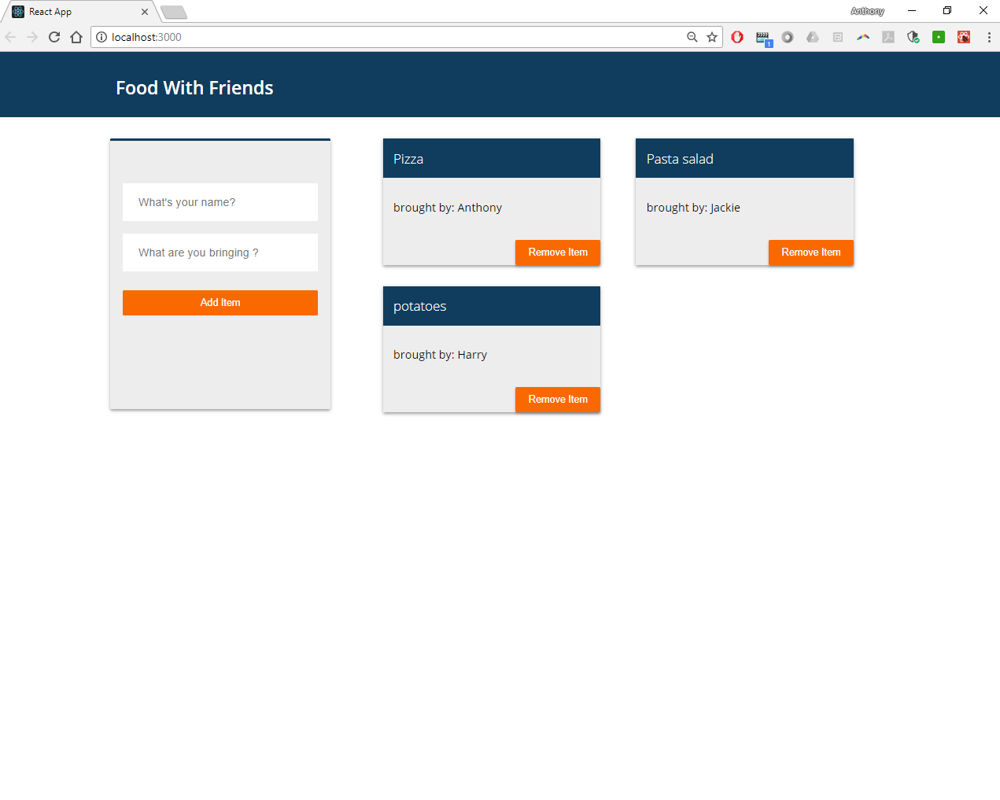

Firebase gmail auth w/ potluck app 
======

# How to ...

1. npm install firebase

2. create firebase project @ https://firebase.google.com/ 

3. copy authorization config settings from `project overview` tab & paste into `./firebase.js`

4. select `database` from firebase sidebar, select `realtime database`, & in `rules` set `.read` & `.write` rqual to `true`

What it does:
======

1.  allows user to add items/remove items for a potluck -- database updates as well 

### Main Window

